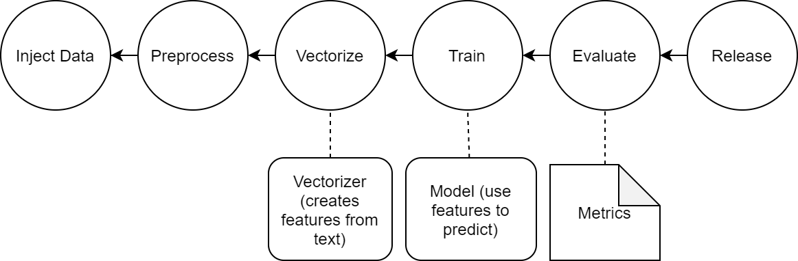

## DVC Example 

Hi, this repository contains demo example from meetup. The goal is to show how to improve Machine Learning workflow with [DVC](https://dvc.org/) 

You can find slides [here](https://docs.google.com/presentation/d/1zKxr4IYhCcxsatVdqEKLTAt6Gbw-JCk0FnsruRKUTGc/edit?usp=sharing)

In this example, a very simple code that solves the problem of sentiment analysis on dasaset from [IMDB](https://www.kaggle.com/lakshmi25npathi/imdb-dataset-of-50k-movie-reviews). The purpose of this example is to show how DVC can be used. `Do not use it as an example of organizing a machine learning project.`

There are implemented following DAG: 



### Pipeline 
```
            +--------------+
            | data\raw.dvc |
            +--------------+
                    *
                    *
                    *
             +-------------+
             | preprop.dvc |
             +-------------+
                    *
                    *
                    *
            +---------------+
            | vectorize.dvc |
            +---------------+
             **            **
           **                **
         **                    **
+-----------+                    **
| train.dvc |                  **
+-----------+                **
             **            **
               **        **
                 **    **
            +--------------+
            | evaluate.dvc |
            +--------------+

```
### Pipeline commands 

```
                                                              +---------------------------------------------------+
                                                              | python src/preproc.py "data/raw/IMDB Dataset.csv" |
                                                              +---------------------------------------------------+
                                                                                        *
                                                                                        *
                                                                                        *
                                                 +-----------------------------------------------------------------------------+
                                                 | python src/vectorize.py data/prepared data/vectorized models/vectorizer.pkl |
                                                 +-----------------------------------------------------------------------------+
                                                     ***********                                                 ***********
                                            *********                                                                       *********
                                      ******                                                                                         ***********
+------------------------------------------------------+                                                                                        *****
| python src/train.py data/vectorized models/model.pkl |                                                                             ***********
+------------------------------------------------------+                                                                    *********
                                                     ***********                                                 ***********
                                                                *********                               *********
                                                                         ******                   ******
                                                 +-----------------------------------------------------------------------------+
                                                 | python src/evaluate.py models/model.pkl data/vectorized classification.json |
                                                 +-----------------------------------------------------------------------------+
```
